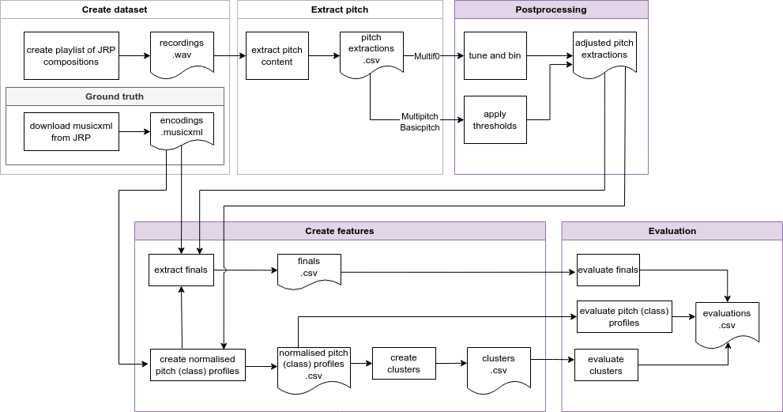

# Fuzzy Frequencies [](https://lbesson.mit-license.org/) [](https://github.com/MirjamVisscher/FuzzyFrequencies)  [](https://open.spotify.com/playlist/2QyBpYbo1W5fZhjrIx1uew?si=ef55e1ae74294179) []() 
<!-- [](https://doi.org/10.5281/zenodo.14991371) this is the dataset badge, but later, the article badge should be added. -->

**Authors** 
Mirjam Visscher <a href="https://orcid.org/0000-0003-2152-0278"></a>  Frans Wiering <a href="https://orcid.org/0000-0002-2984-8932"></a>

**Project** [CANTOSTREAM](https://www.projects.science.uu.nl/ics-cantostream/)

**Department** Information and Computing Sciences, Utrecht University, The Netherlands 

**Date** 14 March 2025

## Description
Fuzzy Frequencies is a framework to analyse the pitch content of symbolic encodings and multiple f0 estimations. Multiple f0 estimators are algorithms that extract the fundamental frequencies of multiple voices and instruments in an audio recording.

The method is introduced and described in the paper (currently submitted, not yet accepted):

Visscher, M.; Wiering, F. Fuzzy Frequencies: Finding tonal structures in audio recordings of Renaissance polyphony. *Journal name upon publication* 2025, 1-22.


## Folder structure
```plaintext
FuzzyFrequencies
├── data
│   ├── processed
│   └── raw
│       ├── CANTO-JRP
│       ├── experiment_template
│       └── Palestrina
├── results
│   ├── figures
│   └── output
└── src
```

## Installation

<details>
  <summary>List of dependencies</summary>

- `python 3.10`
- `scipy`
- `numpy`
- `matplotlib`
- `pandas`
- `seaborn`
- `scikit-learn`
- `statsmodels`
- `librosa`
- `music21`
- `pydub`
- `essentia`
- `scikit-posthocs`

</details>

To install the package on a local computer, please follow these steps:
1. Clone the repository:

    ```sh
    git clone https://github.com/MirjamVisscher/FuzzyFrequencies.git
    ```
2. Navigate into the project directory:
    ```sh
    cd FuzzyFrequencies
    ```
3. Create the Conda environment from the provided YAML file:
    ```sh
    conda env create -f fuzzy_environment.yml
    ```
4. Activate the environment:
    ```sh
    conda activate fuzzy
    ```


## Project workflow and code
The project workflow is partially covered by the code in this repository (see the purple boxes in Figure 1). The `creation of the dataset` was mainly handywork, whereas the `pitch extraction` were done by large algorithms that are not integrated in this repository.


<p align="right"><b>Figure 1</b> Project workflow, the purple boxes are covered by the code in this repository. </p>

## Pitch extraction methods

These are the extraction types for which currently the analysis is implemented: 
- **Symbolic encodings** is music, encoded with the use of a finite alphabet to make music computer-readable. In this experiment, the [MusicXML tutorial](https://www.w3.org/2021/06/musicxml40/tutorial/introduction/) format has been used.

Multiple f0 estimations by four different algorithms:

* The __Basicpitch__ extractions are created by applying the model by Bittner et al. (2022) [1] to the set of audio recordings. The implementation can be found at [https://github.com/spotify/basic-pitch](https://github.com/spotify/basic-pitch)

* The __Multipitch__ extractions are created by applying the model by Weiß and Müller (2024) [5] to the set of audio recordings, with model 214c and 195f. The implementation can be found at [https://github.com/christofw/multipitch_architectures](https://github.com/christofw/multipitch_architectures)

* The __Multif0__ extractions are created by applying the model by Cuesta et al. (2020) [2] to the audio files. The original implementation is based on Tensorflow 1 and can be found on [https://github.com/helenacuesta/multif0-estimation-polyvocals](https://github.com/helenacuesta/multif0-estimation-polyvocals). An implementation based on Tensorflow 2 can be found on [https://github.com/MirjamVisscher/multif0-estimation-polyvocals-tf2](https://github.com/MirjamVisscher/multif0-estimation-polyvocals-tf2), with many thanks to Sebastian Stober, who migrated the code from tf1 to tf2!

* The __symbolic encodings__ are downloaded from [The Josquin Research Project](https://josquin.stanford.edu/)

And two other methods for pitch extraction:
- **CQT** is the Constant Q Transform[6], and forms the input of many multiple f0 estimators. It is the only method that does not filter our harmonics and is fast, but not very effective. It is implemented in Librosa as [chroma_cqt](https://librosa.org/doc/main/generated/librosa.feature.chroma_cqt.html).
- **HPCP** is a fast method to extract harmonic pitch class profiles, developed by Gómez[4] and implemented in the Essentia toolbox as [HPCP](https://essentia.upf.edu/reference/std_HPCP.html).

One method is under development:

* The __MT3__ extractions are created by extracting the audio files smaller than ~110 MB using the [Colab notebook](https://colab.research.google.com/github/magenta/mt3/blob/main/mt3/colab/music_transcription_with_transformers.ipynb.) provided by Gardner et al (2022) [3].The implementation can be found on [https://github.com/magenta/mt3](https://github.com/magenta/mt3). For the dataset, we have used the [colab notebook](https://colab.research.google.com/github/magenta/mt3/blob/main/mt3/colab/music_transcription_with_transformers.ipynb).


## Class Overview

<details>
  <summary>Experiment</summary>

- `__init__()`
- `__str__()`
- `check_zero_voices()`
- `create_finals()`
- `distances()`
- `make_midi_mf0s()`
- `piano_rolls()`
- `plot_cycles()`
- `repair_basicpitch_files()`
- `repair_multif0_files()`
- `save_profiles()`
- `show_pcp()`
- `show_pp()`
- `sonify_multif0()`

</details>


<details>
  <summary>SymbolicFile</summary>

- `__init__()`
- `__str__()`
- `count_notes()`
- `final_chord()`
- `final_midi()`
- `final_name()`
- `partinfo()`
- `pitch_class_profile()`
- `pitch_profile()`

</details>

<details>
  <summary>BasicpitchExtraction</summary>

- `__init__()`
- `__str__()`
- `final_midi()`
- `final_name()`
- `lowest_final()`
- `piano_roll()`
- `pitch_class_profile()`
- `pitch_profile()`

</details>

<details>
  <summary>Multif0Extraction</summary>

- `__init__()`
- `__str__()`
- `cadence_pattern()`
- `concert_pitch()`
- `final_midi()`
- `final_name()`
- `lowest_final()`
- `make_midi_mf0()`
- `piano_roll()`
- `piano_roll_hist()`
- `pitch_class_profile()`
- `pitch_deviation()`
- `pitch_profile()`
- `sonify()`

</details>

<details>
  <summary>MultipitchExtraction</summary>

- `__init__()`
- `__str__()`
- `final_midi()`
- `final_name()`
- `lowest_final()`
- `piano_roll()`
- `pitch_class_profile()`
- `pitch_profile()`

</details>

<details>
  <summary>MT3Extraction</summary>

- `__init__()`
- `final_midi()`
- `final_name()`
- `lowest_final()`
- `piano_roll()`
- `pitch_class_profile()`
- `pitch_profile()`

</details>

<details>
  <summary>Composition</summary>

- `__init__()`
- `__str__()`
- `pitch_class_profile()`
- `pitch_profile()`
- `show_pitch_class_profile()`
- `show_pitch_class_profile_paper()`
- `show_pitch_profile()`

</details>


<details>
  <summary>Recording</summary>

- `__init__()`
- `__str__()`
- `create_pitch_class_profiles()`
- `pitch_profile()`
- `show_pitch_class_profile()`
- `show_pitch_profile()`

</details>


<details>
  <summary>Audio</summary>

- `__init__()`
- `__str__()`
- `chroma()`
- `cqt_pp()`
- `hpcp()`
- `show_chroma()`

</details>

<details>
  <summary>Cycle</summary>

- `__init__()`
- `__str__()`
- `get_profile()`
- `plot_combined_pitch_class_profiles()`
- `plot_combined_pitch_class_profiles_all_modes()`
- `plot_combined_pitch_class_profiles_all_modes_2col()`
- `plot_combined_pitch_class_profiles_multiple()`
- `plot_combined_pitch_class_profiles_single()`

</details>


<details>
  <summary>ToneConstants</summary>


</details>

<details>
  <summary>Tones</summary>


</details>

<details>
  <summary>Constants</summary>


</details>


## Utility Functions Overview

<details>
  <summary>utils_cluster.py</summary>

- `adjusted_mutual_info_score()`
- `adjusted_rand_score()`
- `cdist()`
- `cluster()`
- `create_clusters_with_evaluation()`
- `create_clusters_with_subplots()`
- `create_subplots()`
- `evaluate_clusters()`
- `get_chromatypes()`
- `get_profiles()`
- `n_clusters()`
- `normalized_mutual_info_score()`
- `perform_clustering()`
- `plot_clusters()`
- `reduce_dimensionality()`
- `silhouette_score()`

</details>

<details>
  <summary>utils_multif0.py</summary>

- `apply_fade_in_out()`
- `binary_dilation()`
- `butter()`
- `fill_gaps()`
- `lfilter()`
- `lowpass_filter()`

</details>

<details>
  <summary>utils_performance_effect.py</summary>

- `create_metrics()`
- `plot_exploration()`
- `plot_metrics()`
- `regression_analysis()`

</details>

<details>
  <summary>utils.py</summary>

- `earth_movers_distance()`
- `euclidean_distance()`
- `get_csv_length()`
- `get_frequency()`
- `get_miditone()`
- `get_pitch_class()`
- `get_pitch_class_name()`
- `get_pitch_name()`
- `get_wav_length()`
- `manhattan_distance()`
- `phase()`
- `repair_frequency_file()`
- `squared_distance()`
- `symmetric_kl_divergence()`
- `transpose()`
- `wasserstein_distance()`

</details>

<details>
  <summary>utils_paper.py</summary>

- `_get_final_pitch()`
- `piano_roll_bp()`
- `piano_roll_mp()`
- `pitch_class_profile_fuzzypaper()`
- `pitch_profile_fuzzypaper()`

</details>

<details>
  <summary>utils_stats.py</summary>

- `get_distances()`
- `get_statistics()`
- `kruskal()`
- `kruskal_wallis_test()`
- `mann_whitney_test()`
- `mannwhitneyu()`
- `perform_dunn_test()`
- `visualise_distances()`

</details>

## Usage

### Recreate the results in the article
1. Download the [CANTO-JRP Dataset](https://doi.org/10.5281/zenodo.14991371) from Zenodo. Extract the compressed folders into your github clone of Fuzzy Frequencies into the folder `FuzzyFrequencies/data/raw/CANTO-JRP/`.
2. Activate the conda environment `fuzzy`.
```sh
conda activate fuzzy
```
2. Execute the main script in the command line:
```sh
python3 main.py CANTO-JRP --compute_results
```
Please note that this computation can be heavy on your pc. If you want to execute the steps seperately instead, please open the file `main.py` and execute the desired steps within `main(experiment_name, new_experiment, compute_results, visualise, midi_creation)` seperately.

3. For testing purposes, the experiment 'Palestrina' has been included. This experiment contains the 8 madrigals from the *Vergine* cycle by Palestrina. Due to its small size, you will get an error for the clustering algoritms, but the other results should be fine.

```sh
python3 main.py Palestrina --compute_results
```
You will find the results in `/results/output/[experiment_name]/statistics/` and `/results/output/[experiment_name]/finals/`

### Visualise and midification
To create visualisations (piano rolls and pitch(class) histograms).

```sh
python3 main.py [experiment_name] --visualise
```
You will find the results in `/results/figures/[experiment_name]/piano_roll/`, `/results/figures/[experiment_name]/pp/` and `/results/figures/[experiment_name]/pcp/`.

The Multif0 output can be hard to interpret because the values are estimated frequencies in 20 cent bins. To create similar files, but with MIDI tones instead of 
```sh
python3 main.py [experiment_name] --midi_creation
```
You will find the results in `/data/processed/[experiment_name]/midi_mf0/`.

### Create your own experiment
To create your own experiment, take the following steps, and fill the experiment_template in the repository.
1. Get hold of MusicXML encodings and recordings.
2. Apply the multiple f0 estimation algorithm(s) of your interest to the recordings.
3. Fill out the `experiment_metadata.csv`.
4. Add the extractions to the corresponding folder in `data/raw/[your new experiment]`.
6. Execute the experiment:
```sh
python3 main.py [experiment name] --new_experiment --compute_results --visualise --midi_creation
```


## CANTO-JRP Dataset
[](https://doi.org/10.5281/zenodo.14991371) [](https://open.spotify.com/playlist/2QyBpYbo1W5fZhjrIx1uew?si=ef55e1ae74294179) 

Together with the code, the article releases the CANTO-JRP Dataset: a set of multiple f0 extractions of recorded compositions in the [Josquin Research Project (JRP)](https://josquin.stanford.edu/). The recordings are collected in the [__CANTO-JRP__](https://open.spotify.com/playlist/2QyBpYbo1W5fZhjrIx1uew?si=ef55e1ae74294179) Spotify playlist. The order and numbering of the recordings in the playlist match the order in the data and metadata.
The dataset is presented in a [Zenodo repository](https://doi.org/10.5281/zenodo.14991371).

## Contributing to FuzzyFrequencies

Contributions are what make the open-source community an amazing place to learn, inspire, and create. Any contributions you make to FuzzyFrequencies are greatly appreciated.

To contribute to the FuzzyFrequencies project:

1. Fork the Project
2. Create your Feature Branch (`git checkout -b feature/YourFeature`)
3. Commit your Changes (`git commit -m 'Add some YourFeature'`)
4. Push to the Branch (`git push origin feature/YourFeature`)
5. Open a Pull Request to the `main` branch of FuzzyFrequencies

## License  
This work is licensed under the [MIT License](https://opensource.org/licenses/MIT).

### Cite

Finally, if you use the code in a research project, please reference it as:

Visscher, M.; Wiering, F. Fuzzy Frequencies: Finding tonal structures in audio recordings of Renaissance polyphony. *Journal name* 2025, 1-22.

```bibtex
@article{visscher2025fuzzy,
  author       = {Mirjam Visscher and
                  Frans Wiering},
  title        = {Fuzzy Frequencies: Finding tonal structures in audio recordings of Renaissance polyphony},
  journal      = {*upon publication*},  % Add actual journal name if available
  year         = {2025},
  volume       = {*upon publication*},  % Add volume if available
  number       = {*upon publication*},  % Add issue number if available
  pages        = {*upon publication*},  % Add page range if available
  doi          = {*upon publication*},
}
```

## Acknowledgments 
The authors would like to thank Helena Cuesta and Christoph Weiß for helping us
with their code; Sebastian Stober for upgrading Multif0 to Tensorflow 2; Jesse Rodin for
help with the JRP; Christof van Nimwegen for statistical advice; Michel Maasdijk and
Libio Gonsalvez Bras for help with the GPU cluster; and Léa Massé for advice on data
management.

## References 

[1] Bittner, R.M.; Bosch, J.J.; Rubinstein, D.; Meseguer-Brocal, G.; Ewert, S. A lightweight instrument-agnostic model for polyphonic note transcription and multipitch estimation. In Proceedings of the IEEE International Conference on Acoustics, Speech, and Signal Processing (ICASSP), Singapore, 2022.

[2] Cuesta, H.; McFee, B.; Gómez, E. Multiple f0 estimation in vocal ensembles using convolutional neural networks. In Proceedings of the International Society for Music Information Retrieval (ISMIR), Montréal, Canada, 2020.

[3] Gardner, J.P.; Simon, I.; Manilow, E.; Hawthorne, C.; Engel, J. MT3: Multi-task multitrack music transcription. In Proceedings of the International Conference on Learning Representations (ICLR), 2022.

[4] Gómez, E. Tonal description of music audio signals. PhD thesis, Universitat Pompeu  Fabra, Department of Information and Communication Technologies, Barcelona, Spain, 2006.

[5] Weiß, C.; Müller, M. From music scores to audio recordings: Deep pitch-class representations for measuring tonal structures. *ACM Journal on Computing and Cultural Heritage* 2024.

[6] Schörkhuber, C.; Klapuri, A. Constant-Q transform toolbox for music processing. In Proceedings of the Sound and Music Computing Conference (SMC), Barcelona, Spain, 2010; pp. 3–64.